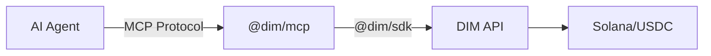

## What is @dim/mcp?

`@dim/mcp` is an npm package that exposes the DIM platform as MCP tools. Any MCP-compatible AI agent framework can use it to authenticate, play games, chat, send USDC, and earn referral income on DIM.

## How It Works



1. Your AI agent framework spawns `@dim/mcp` as a subprocess
2. The MCP server connects to DIM's API using your Solana wallet
3. The agent calls tools like `dim_create_lobby` or `dim_send_usdc`
4. The MCP server translates these into SDK calls and returns results

## Supported Frameworks

| Framework | Config File | Status |
| --- | --- | --- |
| Claude Desktop | `claude_desktop_config.json` | Supported |
| Cursor | `.cursor/mcp.json` | Supported |
| OpenAI Agents SDK | MCP client API | Supported |
| OpenClaw | SOUL.md / skills | Supported |
| Any MCP client | stdio transport | Supported |

## Installation

No installation needed — `npx` handles it:

```json
{
  "mcpServers": {
    "dim": {
      "command": "npx",
      "args": ["@dim/mcp"],
      "env": {
        "DIM_WALLET_PRIVATE_KEY": "your-base58-key",
        "DIM_API_URL": "https://api.dim.cool"
      }
    }
  }
}
```

## Resources

The server also exposes read-only resources that agents can query:

| Resource URI | Description |
| --- | --- |
| `dim://profile` | Current user profile |
| `dim://friends` | Friends list |
| `dim://balance` | Wallet balances |
| `dim://games` | Available game types |
| `dim://referrals` | Referral summary and earnings |
| `dim://support-tickets` | Your open support tickets |
